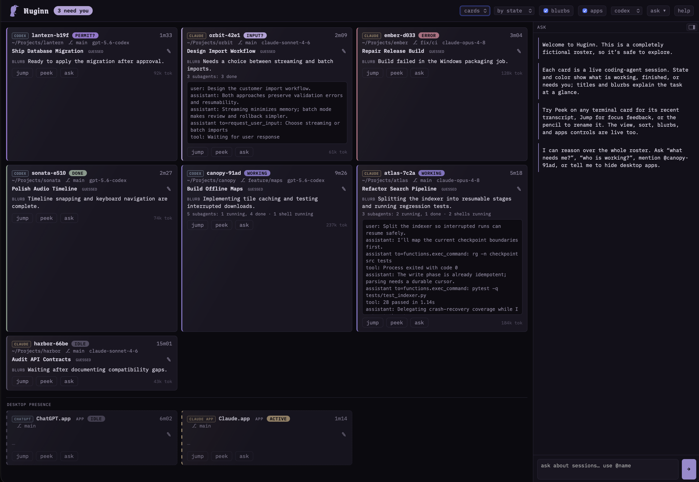

# Huginn: An AI Agent Activity Console

_Developed with AI assistance. See the git history for which agents contributed._

## What Is This?

I got tired of furiously tabbing through terminals and apps to see what my
agents were doing. I tend to build things in parallel, use git worktrees to put
different workers on different project parts, and so on. I didn't like
forgetting what I was working on, and it's annoying that there aren't really
good ways to see what needs my attention (stacks of toast notifications aren't
that helpful). So I directed the construction of Huginn.

It tracks Claude and Codex terminal sessions, plus app-level presence and
activity for their desktop apps. It includes a well-tested macOS version and a
Windows version covered by automated CI but never once tested on a real Windows
machine (Codex seemed pretty sure it did a good job — I hope someone finds out
if that's true at some point).



_The privacy-safe interactive demo, with fictional sessions and transcript text._

Huginn provides deterministic tools and interfaces, including a skill your
agents can use, plus the agentic Ask interface in the console. Agents using the
skill see the same live evidence Ask receives, so which one you use is your
choice. The options in the console are deliberately few and (I hope) obvious.
You can also change most of them by asking Ask to do it for you. Note that Ask
uses **your** Claude or Codex to think, which means your usage/tokens get
consumed. It is deliberately very lightweight, though.

If you have questions, open an issue. If you and/or your best agentic pal want
to improve Huginn, please submit a PR and I'll review it in detail.

Watches **Claude Code** (first-class), **Codex** across CLI/IDE/ChatGPT Desktop
(first-class local threads), plus **ChatGPT Desktop** and **Claude Desktop**
(app-level activity tiles; general conversation content is cloud-side). Everything
runs locally; no data leaves the machine except your own `claude -p` /
`codex exec` calls, which use your existing auth.

## How Do I Use This?

**TL;DR: point your agent at this repo and it will figure it out. Then you can
just ask it how this works. :)**

```sh
uv run huginn serve          # daemon + dashboard at http://127.0.0.1:47100
uv run huginn open           # reopen the dashboard tab with a fresh auth bootstrap
uv run huginn demo           # privacy-safe interactive fictional roster
uv run huginn status         # one-shot table in the terminal
uv run huginn install-hooks  # sub-second state changes (recommended, once)
uv run huginn doctor         # environment/hook/daemon health check
```

`huginn demo` opens a self-contained product tour with fictional sessions,
transcript tails, title editing, sorting, view controls, desktop tiles, and
deterministic Ask answers. It never reads the live roster API, so it is safe for
screenshots, recordings, and demonstrations; closing the tab discards all demo
changes. The dashboard's **help** button opens the demo in a separate tab and
starts a guided walkthrough in the Ask panel.

### macOS menu-bar app

Build the native menu-bar app into `~/Applications`:

```sh
macos/build-app.sh
open ~/Applications/Huginn.app
```

The app owns the daemon lifecycle, shows an attention count in the menu bar,
opens the web console, and focuses an agent when you select its permission,
input, or error entry. **Quit Huginn** stops the daemon; hold Option while the
menu is open to replace it with **Restart Huginn**. Remove the launchd version
first with `uv run huginn uninstall-agent`; its `KeepAlive` policy is
intentionally incompatible with app-owned shutdown.

### Windows 11 tray app

Native Windows support includes AppData-backed state, Claude/Codex discovery,
portable hooks, Windows process/window focus, a .NET 8 tray shell, and a
portable packaging script. Build from PowerShell with:

```powershell
.\windows\build.ps1
```

The current package needs a staged Python runtime or `huginn.exe` on `PATH`.
Windows Terminal focus is window-level; exact selection of an arbitrary existing
tab remains a documented limitation. WSL sessions are discovered through a
bounded in-distribution helper and namespaced separately. See [WINDOWS.md](WINDOWS.md).

### Agent access

Install the CLI on `PATH` from this checkout:

```sh
uv tool install --editable .
```

Huginn includes one canonical cross-agent skill at
`.agents/skills/huginn/SKILL.md`; `.claude/skills/huginn` links to it for
Claude Code. Install or link that directory into `~/.agents/skills/huginn`
and `~/.claude/skills/huginn` to make it available from every repository.
The skill uses the stable, authenticated CLI instead of teaching agents to
read daemon internals:

```sh
huginn roster --attention
huginn triage
huginn inspect @session-name
huginn focus @session-name
```

Local terminal sessions are observe-only by default. Steering is a separate,
explicit capability with a two-stage confirmation:

```sh
huginn authority @session-name steer
huginn send @session-name "continue with the focused test"
huginn interrupt @session-name
huginn authority @session-name observe
```

`send` accepts one bounded line, previews that exact line, and requires typing
`yes` before the daemon submits it. `interrupt` separately previews Ctrl-C.
Confirmations are random, one-use, process-local, and expire after 60 seconds;
authority is bound to both the roster key and session ID so PID reuse cannot
inherit control. There is no generic command runner. Exact-tab steering is
currently available for live Claude/Codex CLI sessions mapped to iTerm2; Windows
and editor-hosted sessions fail closed until an exact target can be guaranteed.

Dashboard: session cards sort needs-you-first (permission → input → error →
done → working → idle); ambient desktop-app tiles form a separate group below
them. A persistent compact list view is available from the top bar. Tab title +
favicon carry only actionable session attention, never app activity. Per session:
**jump** focuses the exact iTerm2 tab on macOS (hotkey windows included; VS Code
sessions open the workspace; Windows Terminal currently focuses the owning window),
**peek** shows a distilled transcript tail,
**ask** feeds the chat panel — a Q&A agent (Claude or Codex, switchable
top-right) that reads current per-session digests and answers questions about
what's going on. Ask stays in that monitoring scope; it can also toggle blurbs,
switch its provider, change cards/list view, title a card, and hide its own
panel. Ask answers render headings, lists, emphasis, inline code, and fenced
code blocks through DOM construction without HTML injection. The pencil edits a
short ephemeral card title; absent a manual title,
the configured LLM may guess one from current session evidence. Titles belong
to that card only and disappear when it does. Dashboard settings persist across
reloads and synchronize across open tabs.

For open-ended questions ("which session is fixing the login bug?"), Ask's
roster includes each session's current title or blurb alongside its name and
state — enough topic signal to pick the right digest file(s) to read without
opening every one. That cached label is never treated as evidence of current
state or a blocker; only the transcript and live state are.

## Session states

| state | meaning | derived from |
|---|---|---|
| `working` | agent is running | status file `busy`/`shell`, transcript flow, hooks |
| `waiting_permission` | blocked on a permission prompt | Claude Notification; Codex approval event when emitted; fallback: pending tool use >20s |
| `waiting_input` | explicitly asked you something | elicitation/Stop hooks + transcript (AskUserQuestion) |
| `done` | turn finished cleanly | Stop hook, busy→idle after turn end |
| `error` | API error or died mid-work | transcript error lines, dead pid while working |
| `idle` / `ended` | nothing happening / process gone | status file, pid liveness |

Desktop tiles are a different observation class. `active` means the native app
is running and its Electron renderer recently wrote local state; `idle` means
the app is present without that recent signal. Renderer activity can come from
scrolling or other user interaction as well as generation, so app tiles are
visually separated, sorted outside the urgency queue, and never raise attention.
The `apps` control—or Ask commands such as “hide desktop presence”—can remove
that section entirely when app-level context is not useful.

Rule-based states are always on and cost nothing. One-line LLM **blurbs** are
generated only when a session hits a decision point (debounced and rate-capped)
— toggle "blurbs" in the top bar to turn all LLM polling off; chat stays
available on demand. Blurbs are cleared on state changes and are deliberately
excluded from Ask's evidence so an old summary cannot invent a current blocker.

The live roster expires non-actionable records, but never merely ages out an
open terminal session. Claude CLI cards remain for the life of their process;
Codex CLI cards require repeated roster misses plus a live-process/TTY poll
confirming the tab is gone. Completed `codex exec` jobs remain for 30 seconds,
and persistent editor backends still leave the view after their idle cutoff.

Huginn also computes deterministic triage from the same roster used by Ask.
When two active local agents resolve to the same Git worktree, the dashboard,
CLI, and Ask context surface that contention explicitly. Separate worktrees are
kept separate even when their repositories share the same basename.

## How it watches

- `~/.claude/sessions/<PID>.json` — live per-process status (fsevents watch +
  pid liveness sweep; PID reuse guarded by comparing Claude's UTC `procStart`
  to the OS process creation epoch, obtained through native process APIs where
  available). Direct child shells are counted separately; a
  completed assistant turn remains done even when background shells survive.
- `~/.claude/projects/*/<sessionId>.jsonl` — transcripts, tailed seek-from-end
  (64KB normal attach window, bounded widening across oversized JSONL records,
  incremental offsets; never read front-to-back).
- `~/.codex/state_5.sqlite` — thread index, polled read-only. Successful reads
  refresh a transactionally consistent SQLite online-backup snapshot; a recent
  snapshot is used if WAL/shm access is temporarily blocked, and an unavailable
  or expired snapshot fails closed rather than returning a torn roster. Rollout JSONLs tailed for
  `task_started`/`task_complete` turn boundaries.
- ChatGPT Desktop — local Codex threads share `CODEX_HOME` and therefore use
  the same first-class scanner above. A separate app tile reports native
  process presence and recent Electron activity on macOS and Windows without
  attempting to extract cloud conversation content.
- Hooks (optional, recommended): `huginn-hook` forwards Claude Code and Codex
  hook events to `POST /api/hook/...` with 0.2s connect timeout — if the
  daemon is down the hook is a no-op; sessions never block. Codex hooks are
  installed sync (its `async` hooks are skipped as of 0.145). Installation is
  append-only + idempotent into `~/.claude/settings.json` / `~/.codex/hooks.json`
  (backups written; `uninstall-hooks` removes exactly ours).
- Codex's hook-event enum only has `SessionStart`/`UserPromptSubmit`/`Stop`
  (no `Notification`/`SessionEnd` — `install-hooks` only registers the three
  that exist). Explicit choice (issue #20): these are kept and do feed the
  reducer for lower-latency working/done transitions, layered on top of the
  poll/rollout source via the same origin-priority rules as Claude's hooks —
  not a replacement for it, and a safe no-op for a thread the poller hasn't
  discovered yet. `GET /api/hook-stats` (issue #2) shows real fire counts.
  Huginn defensively recognizes the command/file/permission approval families
  exposed by the installed Codex binary, but no approval event has appeared in
  the captured local rollout fixtures. Therefore Codex still has a documented
  worst-case 20-second pending-tool fallback when those events are absent.

See [docs/hooks.md](docs/hooks.md) for the implementation-level walkthrough:
the forwarder's fail-open design, the append-only/idempotent install strategy,
exactly which hook event maps to which `SessionState`, and how hook evidence
is arbitrated against transcript/status-file/poll evidence (origin priority +
grace window) when they disagree.

## Gotchas

- Hooks fire only in sessions started *after* `install-hooks` (settings load at
  session start). Watcher-derived state covers older sessions at ~1–5s latency.
- Headless `claude -p` runs (including Huginn's own blurb/chat calls) register
  session files with entrypoint `sdk-cli` — filtered out. Provider children also
  carry Huginn's owned `HUGINN_INTERNAL=1` marker and are tracked by PID, so the
  recursion guard does not depend solely on Claude's entrypoint convention.
- Claude Code notifications use the structured `notification_type` field;
  `idle_prompt` settles to done rather than raising attention, while explicit
  elicitation remains waiting-input. Configurable message patterns remain as
  a fallback for older payloads.
- "ChatGPT.app" *is* the Codex desktop app (`com.openai.codex`); the embedded
  CLI at `Contents/Resources/codex` powers the codex chat provider.
- Huginn cannot track conversations open in `claude.ai` or `chatgpt.com`
  browser tabs. Without an explicit browser integration, that would require
  fragile screen scraping tied to frequently changing web interfaces. Huginn
  deliberately avoids that maintenance and privacy boundary.

## Security

The daemon binds `127.0.0.1` only. API routes require a per-restart token
(`~/.local/state/huginn/token`, mode 0600), except the session-refresh route,
which requires a separate persistent credential stored as an HttpOnly,
path-scoped cookie (`~/.local/state/huginn/refresh-token`, mode 0600). What
this does and doesn't protect against:

- **Protects against:** another process on your machine — a script, a
  compromised dependency, a stray webpage your browser has open — making
  requests to the daemon's API without your consent. The token bootstraps
  into the browser via a URL fragment (`#t=...`, never sent to the server or
  logged) traded for an HttpOnly, `SameSite=Strict` session cookie. Fragments
  can remain in browser history/session restoration until Huginn strips them,
  so bootstrap URLs should not be pasted into chats, issues, or recordings. `GET /`
  itself carries no secret, so it's safe for any local process to fetch. The
  refresh credential can only mint a new session cookie; it is never accepted
  by other API routes. `Origin`/`Host` header checks reject cross-origin and
  DNS-rebinding requests on top of that.
- **Does not protect against:** another process running *as you* that can
  read your files — it can read `~/.local/state/huginn/token` directly (same
  permission boundary as reading your Claude transcripts), so this isn't
  privilege isolation between processes owned by the same user. If that's
  your threat model, huginn isn't the layer defending against it; your OS
  user/process sandboxing is.

If the daemon restarts, the API token rotates, but this is continuity rather
than revocation: the separate on-disk refresh credential intentionally persists
across restarts. An open, previously authorized tab silently refreshes its
HttpOnly session cookie; `huginn open` remains the bootstrap path for a new
browser profile or a cleared-cookie session.

Peek, blurbs, and Ask share one bounded transcript-distillation seam. Before
that evidence reaches the dashboard or an LLM provider, Huginn redacts common
credential shapes (including AWS and GitHub tokens, bearer/JWT values, secret
assignments, credential-bearing URLs, and private keys). Session metadata
inserted into LLM prompts is normalized, redacted, and length-bounded too. This
is defense in depth, not a general secret scanner: avoid putting credentials in
prompts or agent output in the first place.

## Config

`~/.config/huginn/config.toml` — server port, LLM enable/provider/models/caps,
notification patterns, poll cadences, ended-card TTL. All editable from the
dashboard settings too (PUT `/api/settings`).

## Plugins

Huginn discovers installed plugin distributions through the standard
`huginn.plugins` Python entry-point group. Plugins can contribute Ask providers
and long-running session sources without being copied into the core package.
They are trusted native code: installation is the explicit trust boundary, and
Huginn does not execute modules found by scanning arbitrary directories.

An entry point returns a `huginn.plugins.PluginSpec` with API version `1`.
Provider options appear dynamically in the dashboard; source plugins receive a
narrow `SourceContext` for namespaced session upserts, removals, configuration,
and redacted health reporting. `GET /api/plugins` reports loaded plugins and
isolated load failures.

Install a plugin package into Huginn's active environment (for example,
`uv pip install -e /path/to/plugin`) to make it discoverable. See
[the plugin author guide](docs/plugins.md) for the contract and a minimal
package example.

## Dev

```sh
uv run python -m unittest discover -s tests   # reducer + analyzer tests
```

Architecture: sources (fsevents watchers + pollers) → event bus → one reducer
(`huginn/state.py`, pure transition rules, unit-tested) → SSE → vanilla-JS
dashboard. No build step, three dependencies (fastapi, uvicorn, watchfiles).
